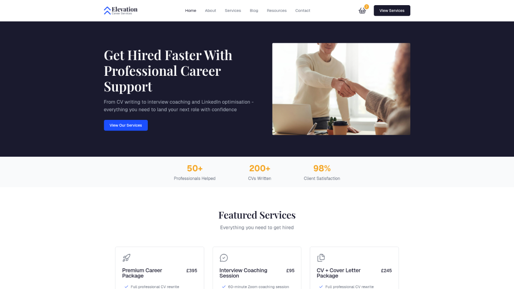
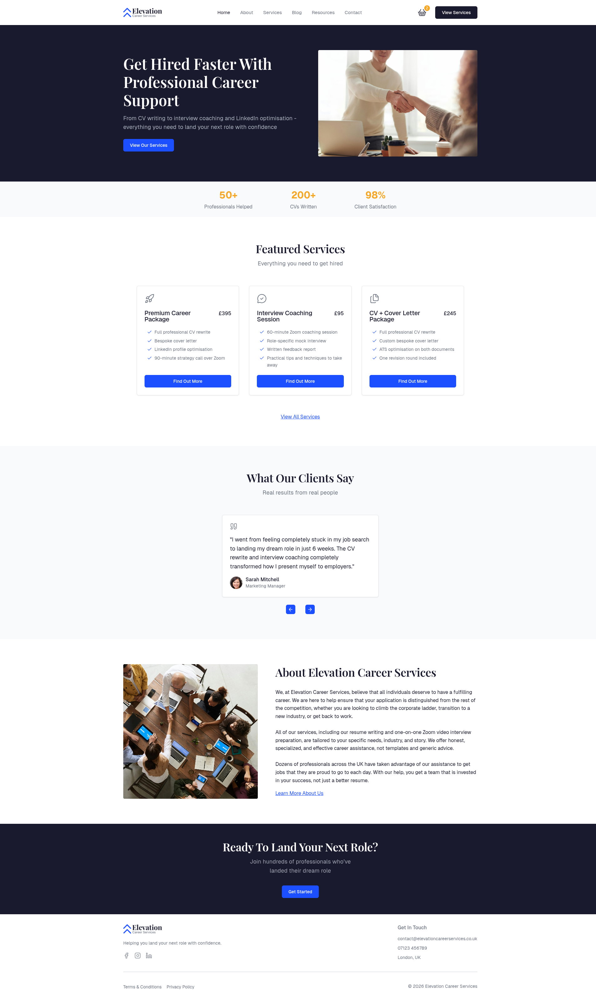
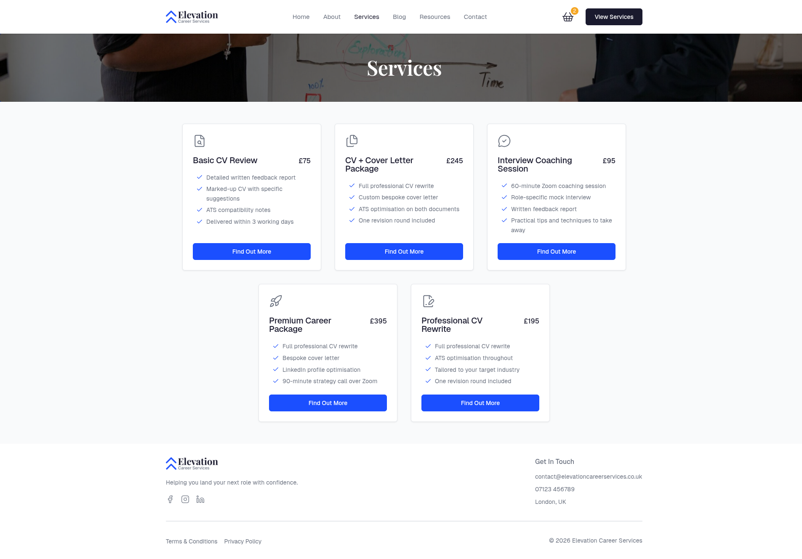
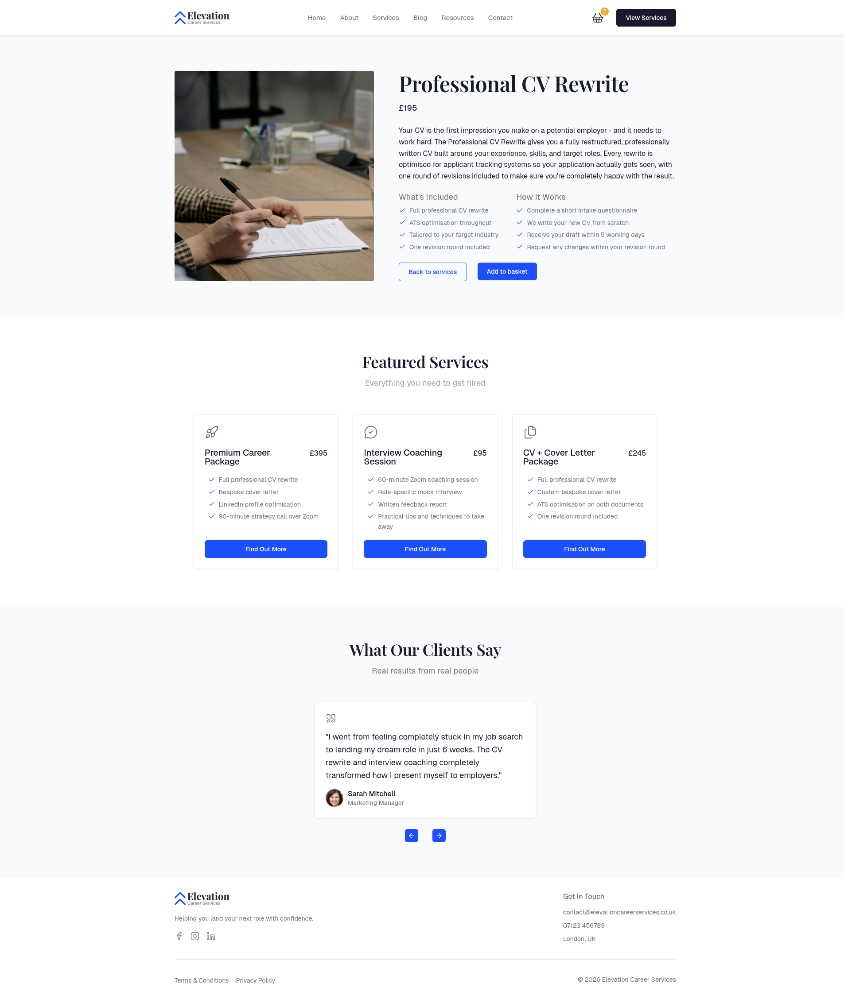
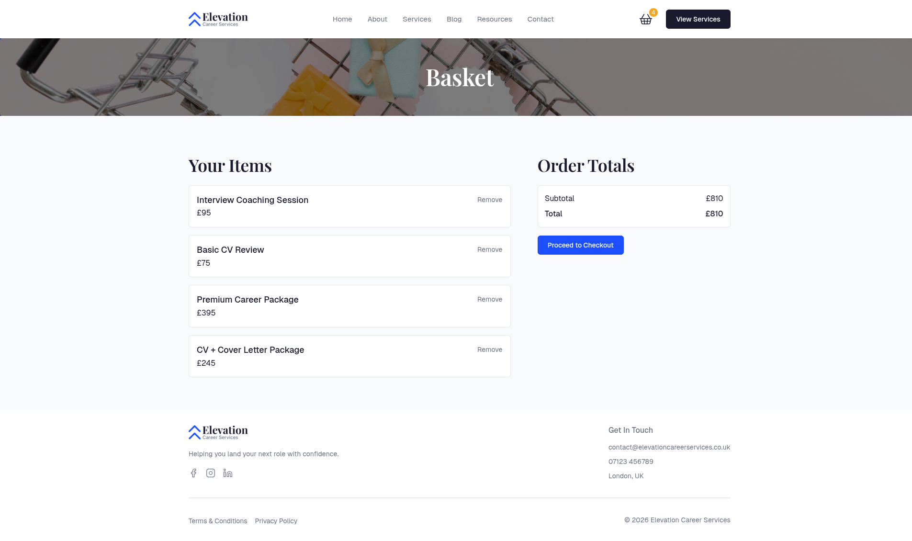
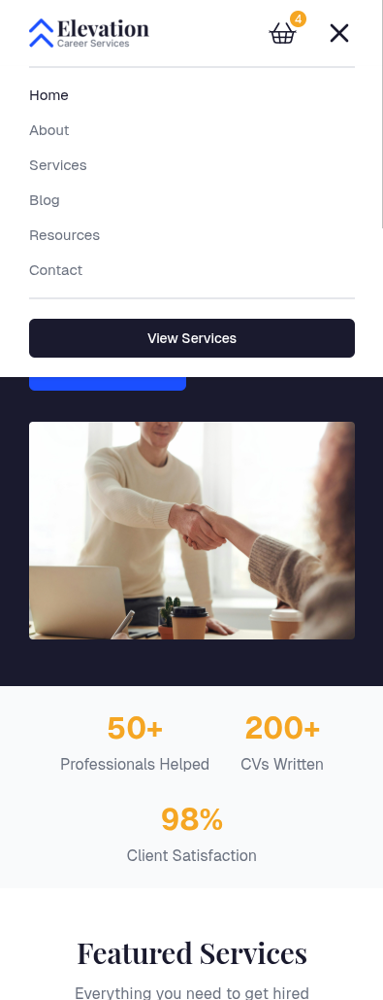
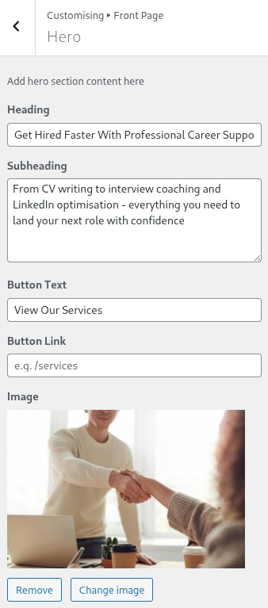
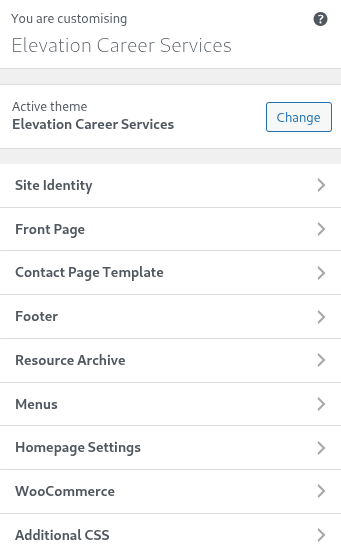

# 🚀 Elevation Career Services - Custom Hybrid WordPress Theme
 

  
A custom hybrid WordPress theme built for a fictional career services company. Classic PHP theme architecture with `theme.json`, two dynamic custom Gutenberg blocks, WooCommerce for selling services and ACF for custom fields and post types - built as a portfolio project to demonstrate real-world WordPress development.
  
💻 [Live Site]()

 

## 🛠️ Tech Stack

**Core**
 
`WordPress` `PHP` `JavaScript` `CSS3` `SCSS` `HTML5`
 
**Plugins**
 
`WooCommerce` `Advanced Custom Fields (ACF)` `Contact Form 7`

 

## ✨ Key Features

### 🧱 Hybrid Theme Architecture
 
A classic PHP theme that uses both of the WordPress paradigms - traditional template hierarchy (`front-page.php`, `single.php`, `archive.php`, etc) in addition to modern block editor features via `theme.json`. Custom dynamic blocks are integrated into the classic theme workflow instead of replacing it.

 

### 🧩 Custom Gutenberg Blocks
 
Two dynamic Gutenberg blocks created with the WP-CLI. Both accept a `count` attribute so admins can control how many cards/slides are displayed without touching code.

- **Featured Services** - Queries WooCommerce products and renders service cards with ACF fields (icon, what's included)
- **Testimonial Slider** - Queries the Testimonial CPT and renders a slider with ACF fields (quote, name, job role, profile photo)

 

### 🛒 WooCommerce Integration
 
Services are sold as WooCommerce products instead of physical goods. This required me to think about integration beyond just a standard ecom shop setup:
 
- **Custom product fields (via ACF):** What's Included, How It Works, and a service icon - displayed on product cards and single product page
- **Template overrides:** product archive, single product, product card, cart templates and more all use custom templates for full layout and styles control and ACF field output
- **Basket UX:** One quantity per service, add-to-cart redirects to the basket and the button switches to "View Basket" if the item is already in the basket
- **Selective styling:** WooCommerce's default frontend styles are removed site-wide and replaced with custom styles - except on the checkout page, where they're kept to avoid unnecessary complexity

 

### 🗂️ Advanced Custom Fields (ACF)
 
- **Service Options Group** - Icon, What's Included, How It Works (attached to WooCommerce products)
- **Testimonials Group** - Quote, name, job role, and profile photo (attached to the Testimonial CPT)

 

### 🎛️ WordPress Customizer
 
Full front page content management via the Customizer - covering the hero, stats bar, about snippet, featured services, testimonials, and CTA banner sections. Also includes footer details (tagline, contact details, copyright name and social links), the contact page image and the resources archive banner.

All sections and parts of sections are conditionally rendered based on which content has been provided in the Customizer to prevent broken or half done sections.

 

### 📌 Custom Post Types
 
- **Resources** - For career advice, guides and templates, with an archive page
- **Testimonials** - For the testimonial slider block, client staff can add new testimonials from the dashboard

 

### 🧭 Header & Navigation
 
Built mobile-first with `header.php` - CSS handles the breakpoint switch rather than duplicating all the HTML.
 
- **Desktop:** Custom logo -> nav links -> WooCommerce basket icon with live item count -> CTA button
- **Mobile:** Collapses to a hamburger menu with animated open/close, icon switching and `aria-expanded` toggling for accessibility
 
Separate menu locations are registered for the navbar and footer.

 

### 🏗️ Reusable, Modular Structure
 
Template parts are split into `/components`, `/content` and `/sections` for clarity. CSS is split into focused files (components, layout, sections, templates) and are imported centrally via `main.css` - with conditionally enqueued files like `woocommerce.css` deliberately excluded from the import and handled separately in `enqueue.php`.

`functions.php` does one thing which is requiring all the files from `/includes` - keeping concerns separated clearly and the codebase easy to maintain.

Design consistency is maintained through `theme.json` variables, CSS variables in `variables.css` and reusable container classes in `containers.css`.

 

### 🎬 Animations

`animate.js` uses an `IntersectionObserver` to trigger fade-in effects as elements scroll into the users view. Applied to the header banner content and all front page section template parts. Kept deliberately subtle, fast and with clean transitions alongside smooth card and button hover effects.

 

### 🖼️ Header Banner Component
 
A reusable `header-banner.php` template part which is used in pages, posts and other templates. Accepts `title`, `subtitle`, and `thumbnail` as arguments and conditionally renders based on what's passed with fallbacks. The thumbnail is used as a background image with the primary colour (defined in `theme.json`) as a fallback. The thumbnail also uses `loading="eager"` and `fetchpriority="high"` which are set to prevent the image flashing that happens when the thumbnail image loads after the rest of the page.

 

### 📄 Page Templates

Two custom page templates are available to use:

- **Contact page** (`page-contact.php`) - A two-column layout with an image on the left and the page content on the right, used for the contact page. The image is managed via the Customizer rather than the block editor for consistent styling control
- **Wide page** (`page-wide.php`) - A wider inner content layout for pages that need more extra width

 

## ✅ Standards & Practices
 
- WordPress coding standards are used throughout, all functions and classes prefixed `ecs_`/`ecs-`
- Outputs escaped with `esc_html()`, `esc_url()`, `esc_attr()` and `wp_kses_post()` where appropriate
- Text is translatable when appropriate and a `.pot` file is included in `languages/`
- Direct access checks (`defined('ABSPATH')`) in every `/includes/` file
- Conditional asset enqueueing (e.g. `woocommerce.css` only loads on WooCommerce pages, basket page and checkout page)
- Designed and developed mobile-first, fully responsive and accessible

 

## 🖥️ Admin Experience
 
The WordPress admin is configured to simulate a real-world client handover:
 
- Menus created and set to the correct locations
- All Customizer options have been filled in
- WooCommerce configured for services (not physical products)
- Full content structure is in place - legal pages, blog page, archive pages and more

 

## 📖 What I Learned
 
- **Hybrid theme development** - Integrating `theme.json` and custom blocks into a classic PHP theme without forgetting the preferred simplicity of classic theme architecture
- **WooCommerce integration** - Template override hierarchy, WooCommerce hooks and filters and making decisions about when and what to override vs when to just style
- **Maintainability** - Structuring a theme with modular architecture, conditional rendering and reusable template parts so it's smooth to extend

 

## 🔮 Future Improvements

- **More custom blocks** - CTA banner and featured resources blocks
- **Testimonials archive** - A dedicated archive page for the Testimonials CPT
- **Stats bar count-up** - Animated number count-up triggered on scroll
- **SCSS refactor** - Convert theme CSS to SCSS for consistency with the block styles and for SCSS's scalability features
- **Featured services block upgrade** - Allow admins to hand-pick which services appear in the block rather than always pulling the most recent

 

## 📸 Screenshots

**Front Page**  

**Services Page**  

**Single Service**  

**Basket**  

**Mobile Navigation**  

**WordPress Customizer**  

